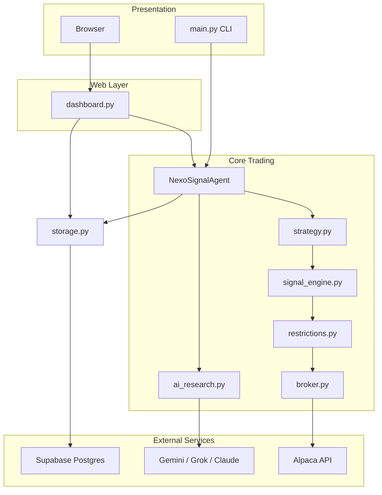
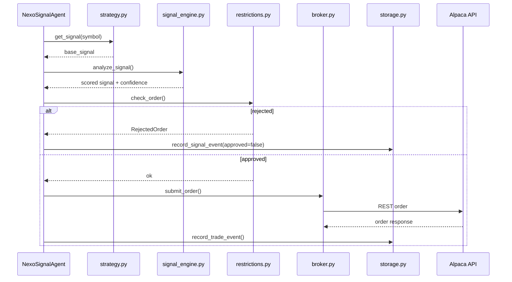

# NexoSignal Project Structure Analysis

## What This Project Is

Despite the workspace folder name (`AI Agent ploymarket`), the project is **NexoSignal** — a Flask dashboard + autonomous **Alpaca** (paper/live) trading agent. It stores trades, signals, intelligence, risk metrics, and telemetry in **Supabase/Postgres**.

There is **no Polymarket integration** in the current codebase. Docs reference a gitignored `polymarket-arb-bot/` folder that is not present in the workspace.

---

## Directory Layout

```text
AI Agent ploymarket/
├── trading_agent/          # Core Python package (business logic)
├── templates/              # Jinja2 HTML (login, dashboard)
├── static/                 # Frontend JS + CSS
├── api/                    # Vercel serverless entry
├── scripts/                # Utility scripts
├── dashboard.py            # Primary Flask web app
├── main.py                 # CLI trading agent
├── requirements.txt        # Python dependencies
├── supabase_schema.sql     # Postgres schema
├── vercel.json             # Vercel deployment config
├── .env.example            # Local env template
└── *.md                    # Documentation
```

| Path | Purpose |
|------|---------|
| `trading_agent/` | Core package: agent loop, broker, signals, strategies, risk, storage, AI |
| `dashboard.py` | Flask app: auth, bot control, REST APIs, optional SocketIO |
| `main.py` | Rich CLI for status, quotes, manual orders, background agent |
| `templates/` | `base.html`, `login.html`, `dashboard.html` |
| `static/` | `dashboard.js` (charts/metrics), `metamask.js`, `styles.css` |
| `api/index.py` | Vercel handler: `handler = app` from dashboard |
| `scripts/dry_run_report.py` | Prints signal/trade summaries from Postgres |

---

## Architectural Layers

The README defines named layers that map to modules:



| Layer | Module | Responsibility |
|-------|--------|----------------|
| **AlphaCore** | `trading_agent/signal_engine.py` | Technical indicator scoring, confluence, confidence gates (non-LLM) |
| **Guard** | `trading_agent/restrictions.py` | Order validation, daily limits, VaR, correlation checks |
| **Executor** | `trading_agent/broker.py` | Alpaca REST wrapper, bracket orders, Telegram alerts |
| **Ledger** | `trading_agent/storage.py` | Postgres CRUD for trades, signals, watchlist, macro, insiders |
| **Agent** | `trading_agent/agent.py` | Scan loop, circuit breaker, APScheduler cron jobs |
| **Scout** | `trading_agent/strategy.py` | Watchlist rebuild, regime detection, earnings skip |
| **Lens** | `trading_agent/ai_research.py` | Multi-LLM research orchestration (optional) |

---

## Entry Points

| Entry | Command | Role |
|-------|---------|------|
| **Dashboard** | `python dashboard.py` | Primary UI at `http://127.0.0.1:5000/login`; bot start/stop, manual orders, JSON APIs |
| **CLI** | `python main.py [--strategy rsi --dry-run --auto]` | Rich TUI for account status, quotes, manual trading |
| **Standalone agent** | `python -m trading_agent.agent` | Runs `NexoSignalAgent` + scheduler without Flask |
| **Vercel** | Deploy via `vercel.json` | Serverless dashboard only (no continuous bot loop) |
| **Report script** | `python scripts/dry_run_report.py` | Dry-run signal/trade summary from DB |

---

## Core Module Details

### `trading_agent/config.py`

Central env loader via `python-dotenv`. Controls:

- Alpaca keys and paper/live mode
- Safety limits (`MAX_POSITION_SIZE_PCT`, `DAILY_LOSS_LIMIT_PCT`, etc.)
- Dashboard auth (single-user or `DASHBOARD_USERS` JSON)
- Supabase connection
- Optional AI keys (Gemini, Grok, Anthropic), Telegram, Phase 2 data APIs

### `trading_agent/agent.py`

`NexoSignalAgent` is the orchestrator:

1. Loads strategy (`sma_crossover`, `rsi`, `vwap` from `strategy.py`)
2. Scans watchlist symbols on an interval
3. Runs signals through AlphaCore → Guard → Broker
4. Records events to storage
5. Runs Phase 2 cron jobs (watchlist rebuild, macro snapshots, insider activity)

### `trading_agent/broker.py`

`AlpacaBroker` wraps Alpaca REST for account, orders, market data. Includes `TelegramNotifier`. Fund transfers are explicitly blocked.

### `trading_agent/storage.py`

`init_db()` + CRUD for tables defined in `supabase_schema.sql`:

- `trade_events`, `signal_events`, `agent_events`
- `wallet_connections`, `brokerage_connections`
- `watchlist`, `macro_snapshots`, `insider_activity`
- `risk_metrics`, `performance_events`

### `dashboard.py`

Flask app with session-based login. Key routes:

- Auth: `/login`, `/logout`
- Bot control: `/bot/start`, `/bot/stop`
- Trading: `/manual-order`, `/orders/<order_id>/cancel`
- APIs: `/api/chart-data`, `/api/live-metrics`, `/api/price/<symbol>`, `/api/ai-research/<symbol>`, `/api/intelligence`, `/api/watchlist`, `/api/macro`, `/api/insiders`, `/api/performance`
- Wallet: `/wallet/metamask`, `/brokerages`

Bot runs in a background thread; SocketIO emits realtime events when available.

---

## Tech Stack

| Category | Technologies |
|----------|-------------|
| Language | Python 3.12+ |
| Web | Flask 3, Jinja2, Flask-SocketIO, vanilla JS |
| Trading | `alpaca-trade-api`, `alpaca-py`, `ta`, `pandas`, `numpy`, `xgboost` |
| Database | `psycopg[binary]` → Supabase/Postgres |
| Scheduling | `schedule`, APScheduler, `pytz` |
| AI (optional) | `google-generativeai`, `openai`, `anthropic`; Ollama via HTTP |
| CLI UX | `rich` |
| Deploy | Vercel (`@vercel/python`) for dashboard; bot intended for local/VPS |

No Node/npm in the main project.

---

## Data Flow (Autonomous Trade)



---

## Configuration and Setup

1. Create venv, `pip install -r requirements.txt`
2. Copy `.env.example` → `.env`
3. Set minimum: Alpaca keys, `TRADING_MODE=paper`, dashboard credentials, `SUPABASE_DB_URL`
4. Run `python dashboard.py` (calls `init_db()` on startup) or apply `supabase_schema.sql` manually
5. Start in **dry-run** mode before live execution

For Vercel: use `.env.vercel.example` and follow `VERCEL_DEPLOYMENT.md`. Serverless deployment serves the dashboard only; the continuous bot loop requires a long-running process (local machine or VPS).

---

## Documentation Map

| File | Contents |
|------|----------|
| `README.md` | Main setup guide |
| `DASHBOARD_README.md` | Dashboard quickstart |
| `ARCHITECTURE_TREE.md` | Folder tree and cleanup notes |
| `PROJECT_STRUCTURE_ANALYSIS.md` | This document — layers, modules, data flow |
| `VERCEL_DEPLOYMENT.md` | Vercel + Supabase deploy |
| `PROJECT_SUMMARY_REPORT.md` | Detailed feature/architecture summary |

---

## Notable Observations

1. **Naming mismatch**: Workspace folder says "ploymarket" but project is NexoSignal/Alpaca — no Polymarket code checked in.
2. **Small codebase**: ~29 files total; core logic concentrated in `trading_agent/` (8 modules) plus `dashboard.py`.
3. **Dual interfaces**: Same agent core powers both CLI (`main.py`) and web dashboard (`dashboard.py`).
4. **Safety-first design**: Guard layer, dry-run mode, paper trading default, fund transfer blocks, circuit breaker in agent.
5. **Optional intelligence**: AI research and Phase 2 features degrade gracefully when API keys or dependencies are missing.
